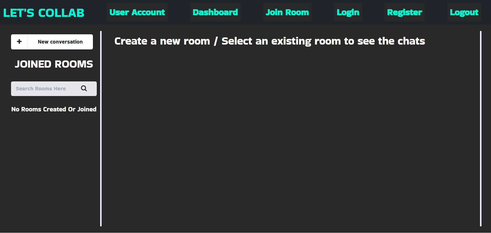
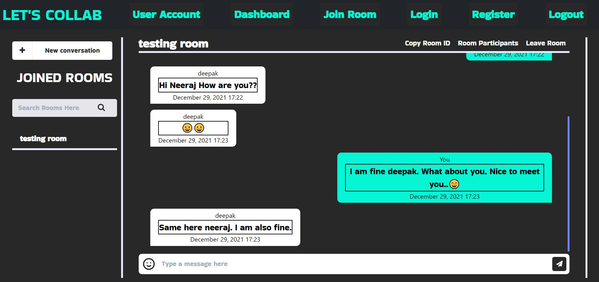

<br />
<p align="center">
  
  <h1 align="center">LET'S COLLAB</h1>

  <p align="center">
    This is a MERN Stack based Chat Application.
    <br /> 
  </p>
</p>

<br>
  <p align="center">
  
</p>
<br>

### Getting Started ⚡ :-

**1. Clone this repo by running the following command :-**

```bash
 git clone https://github.com/Rahul1582/Lets_Collab.git
 cd backend
```

**2. Now Install all the required packages by running the following commands :-**

```bash
 npm install
 npm run install-client
```

**3. Now start the React and Node server together by running the following command :-**

```bash
 npm run dev
```

**3.** **🎉 Open your browser and go to `https://localhost:3000`**

### Features and Functionalities 😃:-

- [x] Home Page.
- [x] Login Page.
- [x] Register Page.
- [x] Navbar.
- [x] Dashboard.
- [x] User Account Page.
- [x] Create New Room Functionality.
- [x] Join Existing Room.
- [x] View Each Room Participants.
- [x] Leave Room Functionality.
- [x] Realtime Messaging Functionality.
- [x] View all Created/Joined Rooms.
- [x] Logout.

### Tech Stack 💻

- [React.js](https://reactjs.org/)
- [Node.js](https://nodejs.org/en/)
- [Express.js](https://expressjs.com/)
- [MongoDB Atlas](https://www.mongodb.com/cloud/atlas)
- [Material UI](https://material-ui.com/)
- [React Bootstrap](https://react-bootstrap.github.io/)

### Screenshots:-

<br>
  <p align="center">
  
</p>
<br>

<br>
  <p align="center">
  
</p>
<br>

<br>
  <p align="center">
  
</p>
<br>

<br>
  <p align="center">
  
</p>
<br>

<br>
  <p align="center">
  
</p>
<br>

<br>
  <p align="center">
  
</p>
<br>

<br>
  <p align="center">
  
</p>
<br>

<!-- <br>
  <p align="center">
  
</p>
<br> -->

### 🤝 How To Contribute?

- Take a look at the Existing Issues or create your own Issues!

- Wait for the Issue to be assigned to you after which you can start working on it.

- Fork the Repo and create a Branch for any Issue that you are working upon.

- Create a Pull Request which will be promptly reviewed and suggestions would be added to improve it.

- Add Screenshots to help us know what this Script is all about.
